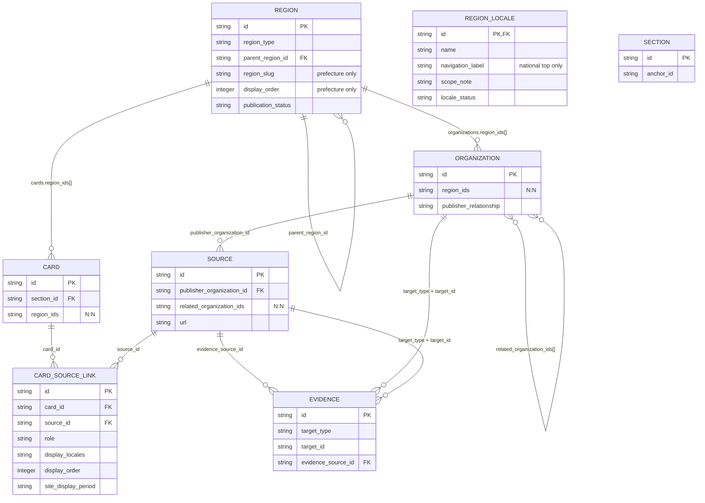
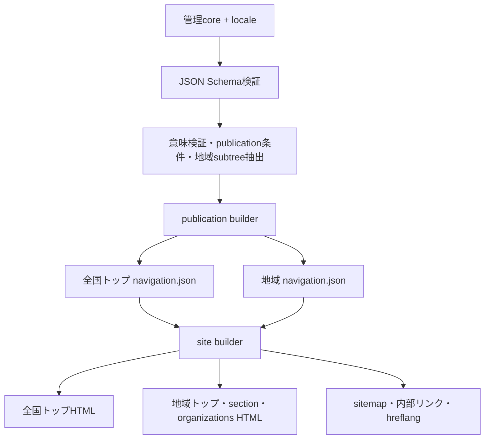

# データリレーションと公開生成フロー

## 文書の位置付け

この文書は、管理用正本データのエンティティと参照関係を記録します。公開`navigation.json`と静的HTMLは、正本から検証・生成される成果物であり、ER図上の正本エンティティではありません。内部メモ、evidenceの詳細、公開状態は公開成果物へ出力しません。

## 工程A基幹ER図

`REGION → REGION`は`parent_region_id`による1:N自己参照です。`REGION ↔ ORGANIZATION`は`organizations.region_ids[]`による概念上のN:N、`REGION ↔ CARD`は`cards.region_ids[]`による概念上のN:Nです。`CARD ↔ SOURCE`は`card-source-links`による明示的N:Nで、role、display_locales、display_order、表示期間など関係自体の属性を持ちます。

`ORGANIZATION → SOURCE`は`publisher_organization_id`による公開元参照です。`SOURCE ↔ ORGANIZATION`は`related_organization_ids[]`による関連団体参照です。`EVIDENCE`は`target_type + target_id`による多相参照で、`evidence_source_id`から根拠sourceへ参照します。

全国版追加項目は、REGIONのprefecture専用`region_slug`・`display_order`、REGION_LOCALEの全国トップ専用`navigation_label`です。掲載対象範囲の説明は既存`scope_note`を再利用し、新しい`scope_description`は作りません。

## 公開生成フロー

全国トップは公開prefecture一覧のみを入力とし、地域固有カードを読みません。地域HTMLは対応する1つの地域成果物だけを主入力とし、別regionや全国トップからカードを補完しません。previewとproductionは同じ抽出・公開契約・検証責務を共有し、工程Aではproductionの正式URL切替を行いません。
